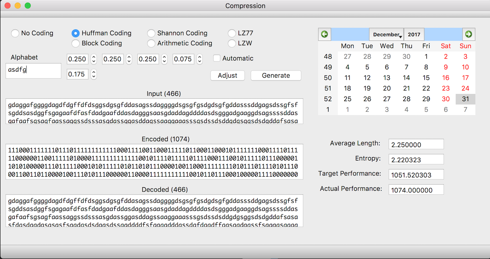
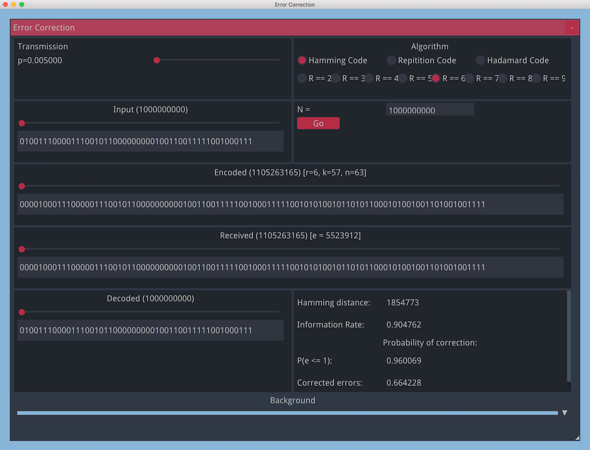

# Encoding

## Author

Created in autumn 2017 by Kirill Rodriguez.

## Contents

* Data compression algorithms with GUI.

* Data error correction algorithms with GUI.

## Tools

### Compression

* C++14
* Qt

### Error correction

* C++14
* nuklear, glfw3, glew
* gmpxx

## Usage

### Prerequisites

Make sure you have everything installed.

Then download [nuklear](https://github.com/vurtun/nuklear) into **correction/** folder.

### Compiling

	make

### Testing

	make test
	
### Cleaning
		
	make clean

## Notes

This is CS3302: Data Encoding coursework.